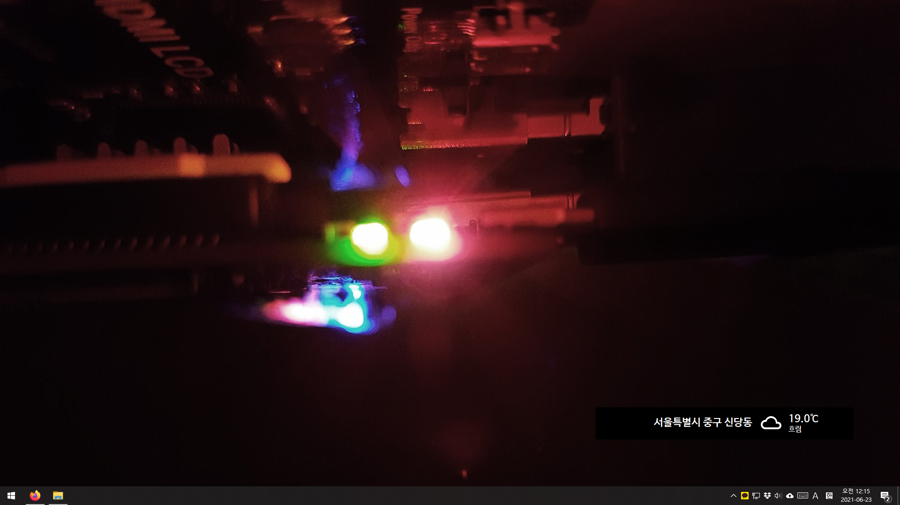

# KorWeatherWidget

바탕 화면에 간략하게 날씨를 표시해주는 위젯 앱

※ This software is intended only for use within South Korea. 
※ 이 소프트웨어는 대한민국에서의 사용만을 염두에 두고 개발되었습니다.

## 소개

기상청에서 날씨 정보를 받아와 바탕 화면에 적당히 표시하는 앱입니다. 
기상청이 제공하는 RSS 서비스를 활용하며, 데이터를 1시간에 한 번씩 갱신합니다. 
개인적으로 사용하기 위해 몇 시간동안 대충 만든 앱이기 때문에 품질 등등 그 어떤 것도 보증하지 않습니다. 
앱이 단순하니 문제가 있다면 직접 고쳐 쓰시는 걸 권해드리고, 고친 점을 공유하고 싶으시다면 PR도 환영합니다.

## 사용법

1. 올바른 글꼴 표시를 위해 [나눔바른고딕](https://hangeul.naver.com/font) 글꼴을 설치합니다.
2. [Releases](https://github.com/sinusinu/KorWeatherWidget/releases)에서 최신 릴리즈를 다운로드하여 적당한 위치에 압축 해제합니다.
3. 동네를 별도로 지정하지 않으면 `서울특별시 중구 신당동`의 날씨가 표시됩니다. 동네를 지정하려면 먼저 [기상청 RSS 서비스](http://www.weather.go.kr/weather/lifenindustry/sevice_rss.jsp) 페이지에 접속해 동네예보에서 원하는 동네를 시/구/동 순서대로 검색한 뒤 `RSS`를 눌러 다음과 같은 형식의 URL을 취득합니다. 
(예시 URL: `http://www.kma.go.kr/wid/queryDFSRSS.jsp?zone=1114061500`)
4. 이어서 앱을 압축 해제한 폴더에 `zone.txt` 파일을 만들고, 해당 파일에 위 URL 맨 끝의 `zone` 값 (예: `1114061500`)을 입력한 뒤 저장합니다. 내용에 줄바꿈이나 공백이 존재해서는 안 됩니다.
5. `KorWeatherWidget.exe`를 실행하여 바탕화면에 위젯이 생긴 것을 확인합니다.
6. 앱을 종료하려면 위젯 위에서 오른쪽 클릭 후 `닫기`를 클릭합니다.

## 라이선스

KorWeatherWidget의 소스 코드는 퍼블릭 도메인으로, WTFPL 라이선스 하에 배포됩니다.

KorWeatherWidget은 아래 오픈 소스 프로젝트를 활용하여 개발되었습니다.
- [Material Design Icons](https://materialdesignicons.com/) (res 폴더의 모든 이미지 파일)
  - Apache License 2.0
- [네이버 나눔글꼴](https://hangeul.naver.com/font) (프로젝트에 포함 안 됨)
  - SIL Open Font License 1.1